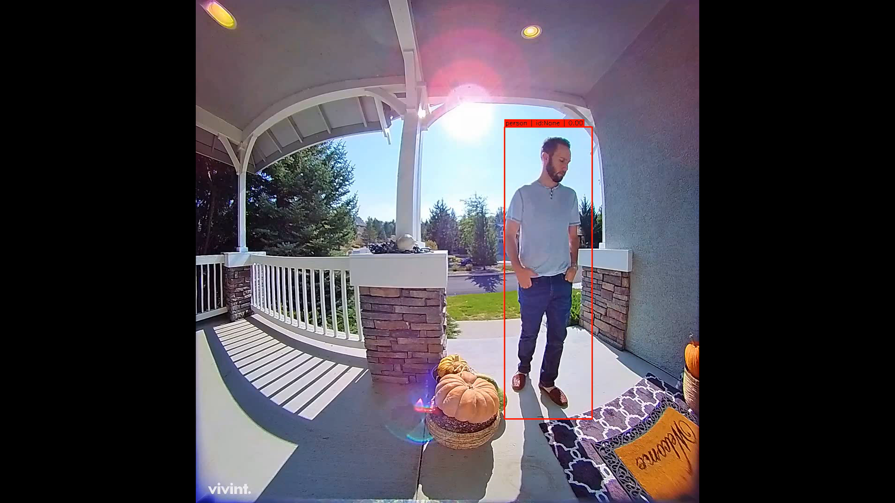
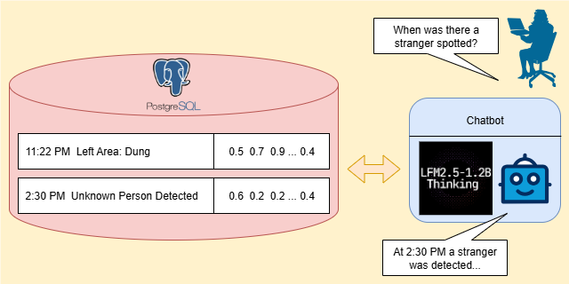

# 👁️ Argus
## AI-Powered Surveillance Intelligence System

Argus is an end-to-end AI surveillance intelligence system that transforms raw visual footage into **structured, queryable security insights**.

---

## Features

Argus supports both video files and live camera streams.

### Detection and Recognition
- Detects humans and vehicles in real time  
- Recognizes registered individuals and distinguishes unknown persons  

### License Plate OCR
- Extracts vehicle license plate numbers from frames

### Behavior Tracking
- Tracks dwell time and movement patterns per tracked object  
- Triggers alerts for high-risk behavior (currently supports prolonged presence of unknown individuals)

### Structured Logging
- Converts raw detections into standardized, human-readable event logs  
- Stores timeline-friendly records for auditing and analysis

### AI-Powered Security Log Querying (RAG)
- Enables natural language querying over historical logs  
- Supports time-aware investigation through retrieval-augmented generation  

---

## How It Works

At a high level, Argus operates as a real-time pipeline:

1. Frames are captured from a camera or video source  
2. Objects are detected and tracked  
3. High-level events are extracted (`new_person`, `new_vehicle`, `object_left`, `stranger_stay_long`)
4. Face recognition and license plate OCR are applied  

5. Visual attributes are extracted from frames and converted into standardized natural language captions  
6. Structured logs, including event types, visual details, and timestamps, are generated and stored  
7. Logs are accessible via both dashboard views and natural language queries    

---

## Key System Design Decisions

### 1. Robust Identity Recognition via Temporal Voting

Single-frame recognition is inherently noisy and prone to false positives.

Argus improves reliability by aggregating recognition evidence across multiple frames of the same tracked individual:
- Collects identity predictions over time per Track ID  
- Applies majority voting and confidence aggregation  
- Confirms identity only after reaching a stability threshold  
- Uses a recognition state machine (`collecting`, `stable_known`, `stable_unknown`, `corrected`) to reduce identity flicker and enable self-correction  

This significantly improves robustness under occlusion, motion blur, and challenging viewing angles.

---

### 2. Real-Time, Non-Blocking Pipeline

Real-time inference can lag on limited hardware when heavy tasks (face recognition, OCR, logging, alerts) run inline, causing backlog and stale frames.

Argus addresses this with a non-blocking pipeline:

  

- The camera loop pushes incoming frames into `ai_process_queue` (`maxsize=8`); if full, the oldest frame is dropped to keep the newest context.
- The AI loop consumes that queue but runs tracking only every 3rd frame (`frame_id % 3 == 1`) to reduce compute load.
- Event extraction and emission are non-blocking: after tracking, the AI loop pushes events to event queues, and per-event worker threads handle recognition/OCR/logging/alerts asynchronously. The AI loop never waits for the workers and continues to process subsequent frames.
- Worker handlers update detection objects in `state_manager`; then the AI loop writes the latest tracked detections to shared `detections_state`.
- The camera loop reads `detections_state`, draws the latest boxes on the current frame, and publishes only the latest stream frame (`stream_queue` size 1 behavior).

This keeps the system responsive under load, maintains low streaming latency, and prevents pipeline stalls. The trade-off is intentional frame dropping and lower per-frame completeness.

---

### 3. Time-First Filtering in RAG Retrieval

Pure embedding similarity is insufficient for time-sensitive queries.

Argus applies a hybrid retrieval strategy:
- First filters logs by time window (SQL)  
- Then performs semantic retrieval on the filtered subset

---

## Limitations

- Performance depends on camera quality, lighting, and scene complexity  
- Frame dropping may miss short-lived events  
- RAG responses depend on the quality and completeness of logs  
- The system is not yet packaged for one-command deployment  

---

## Acknowledgements

**dungquangvn** — system design, architecture, and end-to-end pipeline implementation  
**nguyetbinh** — development of the face recognition model  
**cmpedz** — initial web interface and frontend setup 
